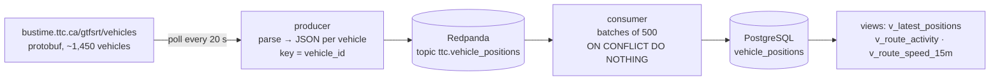

# TTC Real-Time Pipeline

_Portfolio sprint timeline: January–September 2026. Reported results retain their actual run dates._

Streams live TTC vehicle positions from the GTFS-Realtime feed through a Kafka-compatible broker
into PostgreSQL, with SQL views for what a transit ops dashboard needs: where every vehicle is
now, how many are active per route, and which routes are crawling.

**Stack:** Python 3.12 · GTFS-Realtime (protobuf) · Redpanda (Kafka API) · PostgreSQL 16 · Docker Compose



## Measured (first run, 2026-09-22 02:17–02:29 UTC)

| | |
|---|---|
| Vehicles in one feed snapshot | 1,434–1,458 |
| Distinct routes with a vehicle assigned | 159 |
| Rows written in 12 minutes | 13,673 (≈ 1,100/min; about 2,800/min during a poll) |
| Duplicates rejected by the primary key | ~3% of messages (vehicles that had not moved since the last poll) |
| Vehicles with no route assigned | 45.7% at 10:30 PM — out of service, deadheading or in the yard; they are kept, with `route_id NULL`, because "how many buses are parked" is also a question |
| Fastest route over 15 min | 900 Airport Express, 44 km/h average |

## Design decisions

| Decision | Why |
|---|---|
| Message key = `vehicle_id` | All positions for a vehicle go to one partition, so a consumer sees them in order and can compute speed from consecutive points. |
| Primary key `(vehicle_id, position_ts)` + `ON CONFLICT DO NOTHING` | The feed repeats a vehicle's last position until it moves and the producer polls faster than vehicles report. The database, not the application, is the dedupe. |
| Commit offsets after the batch is written | At-least-once delivery. A crash mid-batch replays it; the upsert makes that harmless. |
| Skip publishing when the feed header timestamp is unchanged | Saves ~1,400 pointless messages per poll when TTC's feed is stale. |
| Speed computed in SQL from consecutive positions (haversine) | The feed's own `speed` field is mostly 0/absent. Window functions do it in one view. |
| Redpanda instead of Kafka + ZooKeeper | Same API, one container, 512 MB. |

## Run it

```bash
git clone https://github.com/prhoguns/ttc-realtime-pipeline.git
cd ttc-realtime-pipeline
docker compose up -d --build          # broker, database, producer, consumer
docker compose logs -f consumer       # watch batches land
```

Then, on `localhost:5434` (`ttc` / `ttc`):

```sql
select * from v_route_activity limit 10;                 -- active vehicles per route, last 5 min
select * from v_route_speed_15m order by avg_km_h;       -- slowest routes right now
select * from v_latest_positions where route_id = '501'; -- every Queen streetcar, now
```

Inspect the topic: `docker compose exec redpanda rpk topic consume ttc.vehicle_positions -n 3`

Tests (parser against a captured feed sample; sink dedupe against Postgres):

```bash
docker compose run --rm --no-deps producer pytest -q                       # parser tests, no network
docker compose run --rm -e POSTGRES_DSN="host=postgres dbname=ttc user=ttc password=ttc" producer pytest -q   # + dedupe test
```

## What I would add next

- Trip updates feed (`/gtfsrt/trips`) → predicted vs scheduled arrival → a lateness metric per route.
- Static GTFS (`routes.txt`, `stops.txt`) as dimension tables so views show "501 Queen" not "501".
- Schema Registry + Avro instead of JSON; a dead-letter topic for unparseable messages.
- A Grafana panel on `v_route_activity`, or the positions into the sister project's dbt models.

Data: TTC GTFS-Realtime, published under the [Open Government Licence – Toronto](https://open.toronto.ca/open-data-license/).
